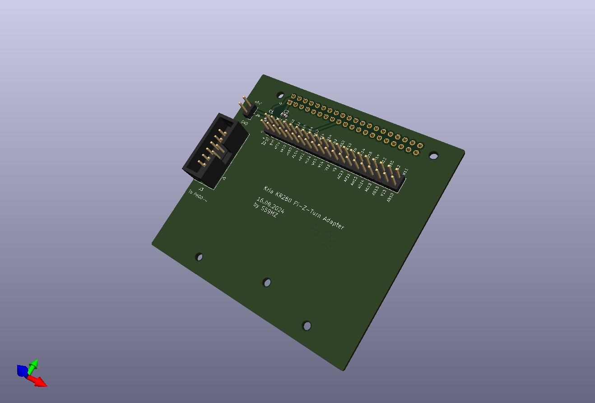
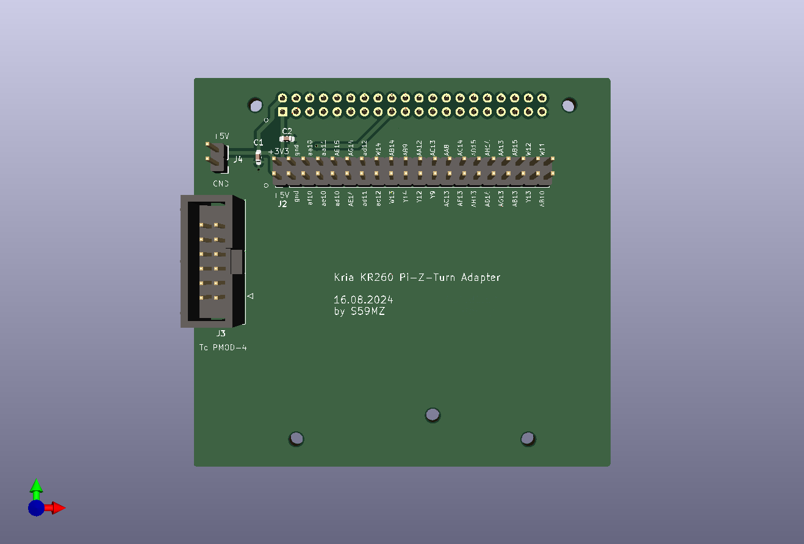
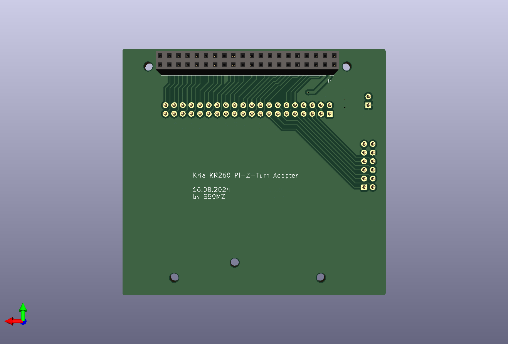

# kicad-kria-pi4-ext
Extension adapter module for the Kria KR260, providing a Pi-4 port to Z-turn port intended for using multiple Alinx modules and PMOD interfaces.

Schematic:
[kicad-kria-pi4-ext.pdf](kicad-kria-pi4-ext.pdf)

BOM:
[kicad-kria-pi4-ext.csv](kicad-kria-pi4-ext.csv)

Gerbers:
[gerbers.zip](https://github.com/s59mz/kicad-kria-pi4-ext/raw/main/gerbers.zip)
